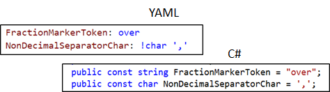
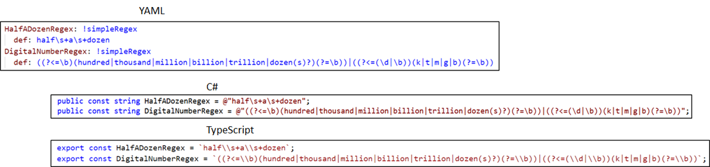
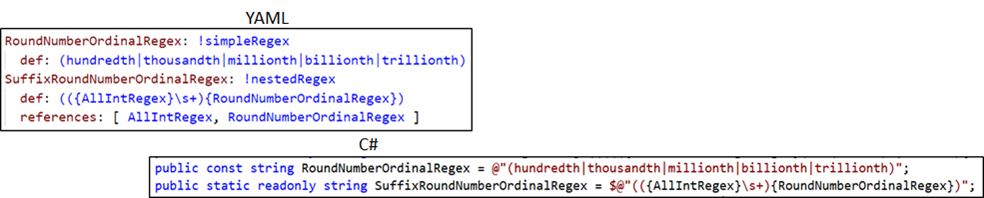
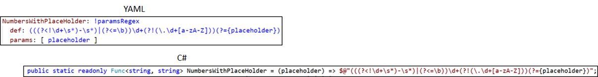
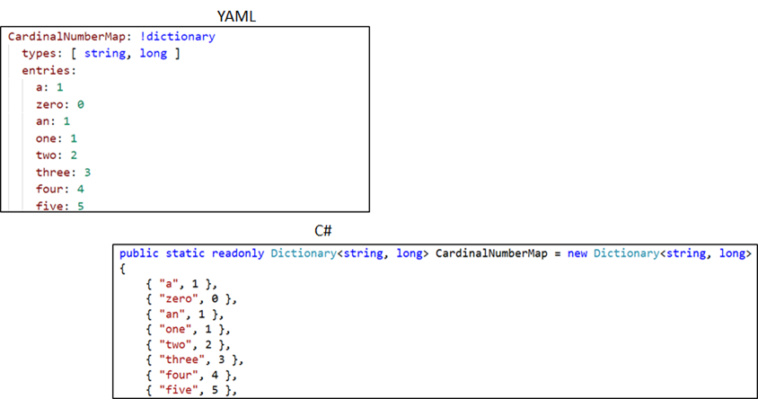
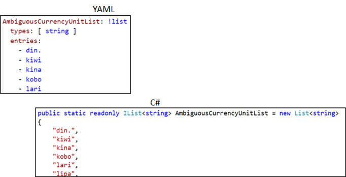
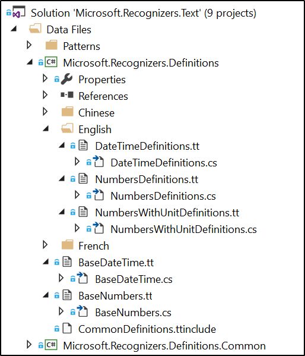
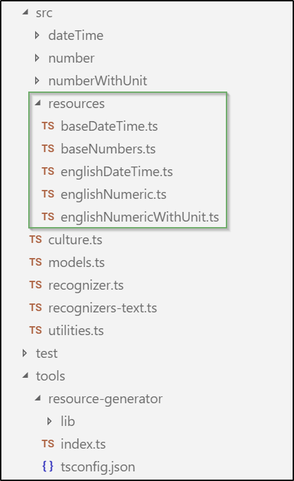

# Patterns
Recognition and resolution of numbers, units, and date/time expressed in multiple languages (e.g. English, French, Spanish, Chinese) is built around several data structures like string constants, regular expressions, lists and dictionaries.
The Microsoft.Recognizers.Text reusable component, currently has implementations in C# and TypeScript/JavaScript.

As contributors incorporate fixes and support for new languages (e.g. Japanese, Korean, German, and Dutch) and new implementations (e.g. Python) a centralized store for data structures becomes crucial.

### YAML
YAML is a human-readable data serialization language. Custom data types are allowed, but YAML natively encodes scalars (such as strings, integers, and floats), lists, and associative arrays (also known as hashes or dictionaries).

> For more information on YAML format read the [The Official YAML Website](http://yaml.org/)

Different implementations will use different methods to generate the required data structures (e.g. the C#  implementation leverages T4 templates to read the YAML files and generate a .CS file containing a single class including all data structures.) 

### Strings and char constants
Use simple scalar entities to generate a string constant. The '!char' tag can be used to force a char constant definition instead of a string one.

 
### Complex structures
For data structures more complex than string or char constants specific YAML tags will be used for different purposes described below:
 
#### simpleRegex
Used for the regex patterns that don't contain other regexes or params within; they're simply escaped string constants.

#### nestedRegex
Used for the regex patterns that are composed with other regexes definitions. It is a common implementation to make regex dependent on other regex patterns. Please, notice the 'references' property and the C# Interpolated String-like notation.
> As a side effect, depending on the language implementation the order of the YAML entities has a direct impact on the final value of the data structures.

 
#### paramsRegex
Used for the regex that is parametrized. Similarly to the nestedRegex notation a parameterized regex pattern is supported and a Function-like implementation.

 
#### dictionary
Used to define a dictionary using basic key and value data types.

#### list
Used to define lists of values of any basic data type.

### Update definitions files
Once the data structures are store in the corresponding YAML files, a series of constants and read-only values must be generated for each implementation.

#### .NET
The C#  implementation leverages T4 templates to read the YAML files and generate a .CS file containing a single class including all data structures for each YAML file.

The Microsoft.Recognizers.Definitions project contains all the required T4 templates and the generated .CS files. Re-processing the T4 templates to update the definition classes can be done upon saving each T4 file individually, using the Visual Studio Build - Transform All T4 Templates menu option or using any VS Extension to automatically trigger all T4 templates in your solution upon build.

#### TypeScript
The TypeScript implementation uses a Node.js program to read the YAML files and generate a .TS files containing a single namespace including all data structures for each YAML file.

The *tools\resource-generator* folder contains the Node.js program which generates the data structures namespaces in the *src\resources* folder. To update the definition namespaces the `build-resources` configured script can be used as follow: `npm run build-resources`.

